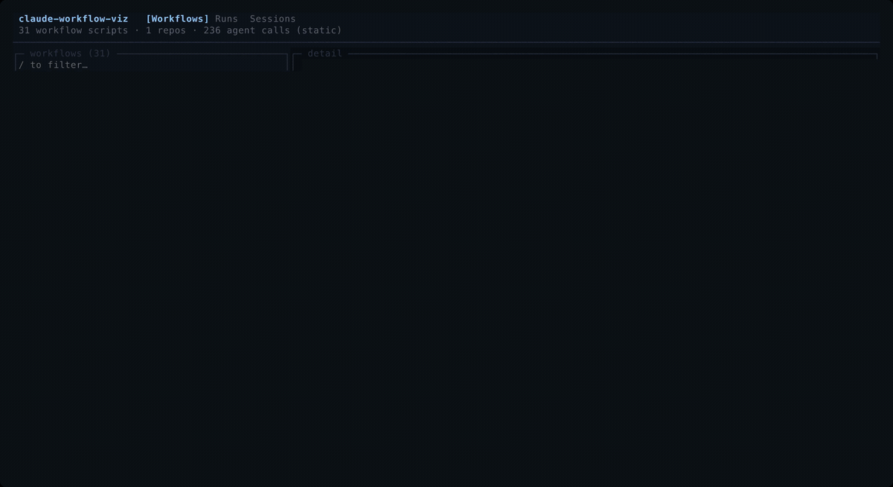
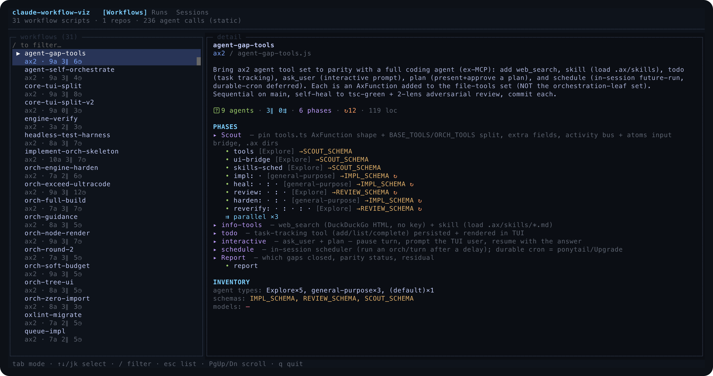
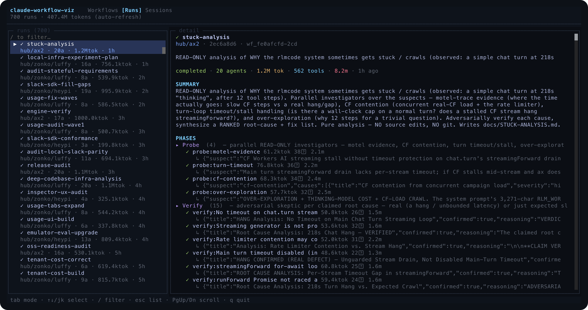
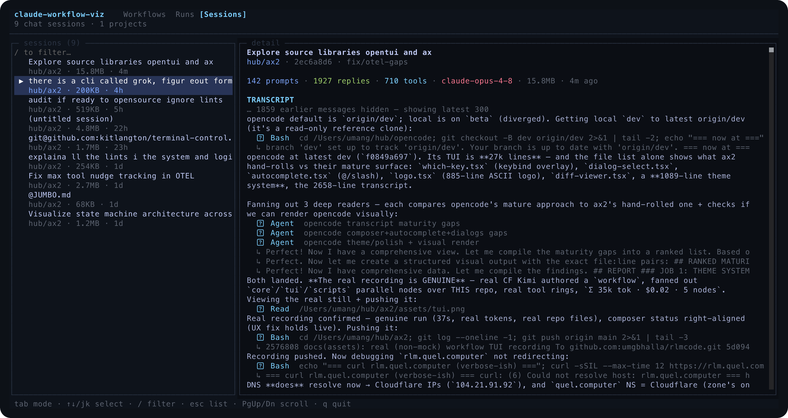

<h1 align="center">cwviz</h1>

<p align="center">
  <b>A terminal UI to see what your Claude Code workflows actually do —<br/>
  the blueprints, the live runs, and the chat history behind them.</b>
</p>

<p align="center">
  
  
  
  
  
</p>

<p align="center">
  
</p>

---

Claude Code's [Workflow tool](https://docs.claude.com/en/docs/claude-code) lets an agent fan
out subagents from a script — `agent()` / `parallel()` / `pipeline()` / `phase()`. Those scripts
live in `.claude/workflows/*.js`, every execution is journaled under `~/.claude/projects/`, and
every conversation is a `.jsonl` transcript. **cwviz reads all three and shows them in one TUI.**

`Tab` cycles three modes:

| Mode | What it shows | Source |
|------|---------------|--------|
| **Workflows** | The *blueprint* — phase tree, every `agent()` call with its `agentType` / `schema` / `model`, `parallel`/`pipeline` fan-out, loops. | `.claude/workflows/*.js`, parsed with [yuku](https://github.com/yuku-toolchain/yuku) — **never executed** |
| **Runs** | Live + historical *executions* — per-agent state (`✓` done · `●` running · `✗` error · `◌` queued), the tool each agent is on, tokens, tool calls, duration, result previews. Auto-refreshes. | `~/.claude/projects/**/workflows/wf_*.json` journals |
| **Sessions** | The *chat history* — full transcript: prompts, replies, tool calls, results, collapsed thinking. | `~/.claude/projects/**/*.jsonl` transcripts (lazy-loaded) |

<table>
  <tr>
    <td width="33%"><p align="center"><sub><b>Workflows</b> — static graph</sub></p></td>
    <td width="33%"><p align="center"><sub><b>Runs</b> — live + historical</sub></p></td>
    <td width="33%"><p align="center"><sub><b>Sessions</b> — chat history</sub></p></td>
  </tr>
</table>

## Why

A workflow script tells you what *should* happen. The run journal tells you what *did* —
which agent stalled, where the tokens went, what each one concluded. cwviz puts the blueprint
next to its executions next to the conversation that started them, so you can actually read your
own orchestration instead of grepping JSON.

## Install

Needs [Bun](https://bun.sh). Then:

```bash
git clone git@github.com:umgbhalla/cwviz.git
cd cwviz
bun install
bun link          # registers the `cwviz` command on your PATH
```

## Use

Run it in **any folder** that has a `.claude/workflows/` directory:

```bash
cd ~/some/repo
cwviz                 # TUI — Tab toggles Workflows ⇄ Runs ⇄ Sessions
```

Headless modes (no TUI — pipe-friendly):

```bash
cwviz --list [dir]    # one line per workflow script
cwviz --runs [n]      # newest n run journals
cwviz --json [dir]    # full static analysis as JSON
```

`dir` defaults to the current folder and is scanned recursively (skipping `node_modules`, `.git`,
`worktrees`, `.deploy`). Runs and Sessions are read from `~/.claude/projects` (all repos).

### Keys

`Tab` switch mode · `↑↓` / `j` `k` select · `/` filter · `esc` back to list · `PgUp` / `PgDn` scroll detail · `q` quit

## How it works

- **Workflows** — [`yuku-analyzer`](https://github.com/yuku-toolchain/yuku) parses each script
  into an ESTree AST (`new Analyzer().addFile(...).ast`), then a `walk()` visitor pulls out the
  `meta` block and every orchestration call. Statically-resolvable strings (literals, no-hole
  templates, `+` concats) are read directly; template holes show as `·`; dynamic fan counts
  (`arr.map(...)`) are reported as dynamic, never guessed. **No code is run.**
- **Runs** — each journal carries a `workflowProgress` event stream (`workflow_phase` +
  `workflow_agent` with `state`, `lastToolName`, `tokens`, `toolCalls`, `durationMs`,
  `resultPreview`). cwviz rebuilds the phase→agent tree from it. In-flight runs are detected from
  start-written `workflows/scripts/<name>-<runId>.js` that have no journal yet; the list
  auto-refreshes every 1.5s so a running workflow appears and updates live.
- **Sessions** — transcripts are large, so the list is built from a cheap head-read (title +
  metadata) and the full transcript is parsed only when you select a session. The selected
  session's `.jsonl` is **`fs.watch`ed** — Claude Code appends it per message, so the transcript
  re-renders in real time and an active session is marked `● LIVE`. No polling.

The exact on-disk layout, line schemas, and write cadence — reverse-engineered from the Claude
Code binary with [bun-demincer](https://github.com/vicnaum/bun-demincer) and verified empirically
— are documented in [`docs/INFRA.md`](docs/INFRA.md).

## Project layout

```
src/
  model.ts  analyze.ts  discover.ts   Workflows: model, yuku analyser, file finder
  runs-model.ts  runs.ts              Runs: model + journal/orphan discovery
  sessions-model.ts  sessions.ts      Sessions: model + transcript parser
  ui.ts                               opentui scene (3 modes, live polling)
  index.ts                            CLI entry
  *.test.ts                           parser + headless-render checks
```

```bash
bun run check     # tsc --noEmit
bun test          # analyser + run parser + session parser + headless render
```

The render test mounts the real scene on [opentui's test renderer](https://github.com/anomalyco/opentui)
and asserts against the captured cell grid — no PTY needed.

## Built with

- [**opentui**](https://github.com/anomalyco/opentui) — the native (Zig) terminal UI core that powers the interface
- [**yuku**](https://github.com/yuku-toolchain/yuku) — the Zig JS/TS toolchain whose analyzer parses the workflow scripts
- [**terminal-control**](https://github.com/kitlangton/terminal-control) (`termctrl`) — drove the real TUI in a PTY to capture every screenshot and the demo above
- [**bun-demincer**](https://github.com/vicnaum/bun-demincer) — extracted the Claude Code binary to map its on-disk infra (see [`docs/INFRA.md`](docs/INFRA.md))
- [**termcast**](https://github.com/kitlangton/termcast) — reference for opentui app patterns
- [**Bun**](https://bun.sh) — runtime; runs the TypeScript directly, no build step

The demo corpus is real: workflows and runs from [Bun](https://github.com/oven-sh/bun) and a
private agent project, browsed live.

## License

[MIT](LICENSE) © Umang Bhalla
